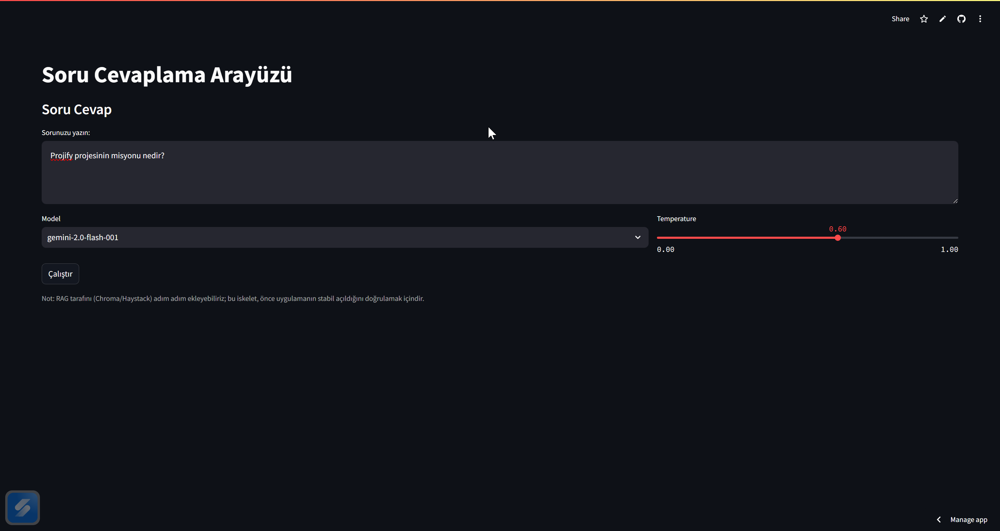
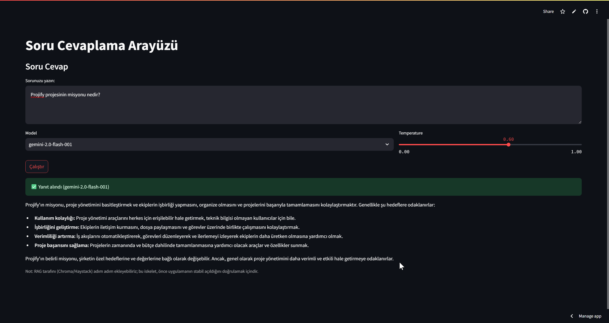

# rag_gemini_chroma_langchain
Akbank GenAI Bootcamp için Gemini 2.0 Flash ve Haystack kullanan RAG tabanlı sohbet robotu /  RAG-based chatbot using Gemini 2.0 Flash and Haystack for Akbank GenAI Bootcamp

Kodun Amacı:
Bu proje, RAG (Retrieval-Augmented Generation) yaklaşımıyla, endüstri mühendisliğimin projesinde merak edilen soruların parçaları bulup Gemini 2.0 Flash modeline bağlayarak cevap üreten bir sohbet uygulamasıdır. Vektör araması için Chroma, orkestrasyon için LangChain/Haystack bileşenleri ve arayüz için Streamlit kullanılır. Depoya ait dosyaların iskeleti GitHub’da şu şekilde görülür: app.py, config.py, data_processing.py, rag_pipeline.py, requirements.txt, data/ (örnek içerik klasörü).

## 🖼️ Uygulama Arayüzü Görselleri

Aşağıda, **Projify RAG + Gemini + Chroma** tabanlı soru-cevap sisteminin Streamlit arayüzü örnekleri yer almaktadır.  
Uygulama, kullanıcıdan gelen metin sorularını alır ve Gemini 2.0 Flash modeliyle anlamlı yanıtlar üretir.

### 🔹 Soru Girişi Arayüzü

### 🔹 Yanıt Alındıktan Sonraki Görünüm

Veri hazırlama: dosyalar data/ altında toplanır -> temizlenir -> parçalara bölünür (chunk) -> embedding’leri hesaplanır -> Chroma vektör veritabanına yazılır.

Sorgu zamanında: Kullanıcı sorusu embed edilir -> Chroma’dan en alakalı parçalar (context) getirilir -> Gemini 2.0 Flash’a, “soru + kaynak parçalar” prompt olarak verilir -> model, kaynaklara dayalı bir yanıt üretir.

## app.py : Kullanıcı “Sor” dediğinde:

metni alır,

rag_pipeline üzerinden retrieve→generate çağrısı yapar,

cevabı, kullandığı kaynak parçalarla birlikte gösterir (istenirse kaynak metinlerini/URL’lerini listeler).

Hata yakalama ve basit log/uyarı mesajları — ör. API anahtarı yoksa uyar.

## config.py — Yapılandırma Ve Ortam Değişkenleri

Gemini API anahtarı, model adı (gemini-2.0-flash), gömme (embedding) modeli, chunk boyutu/örtüşme, Chroma dizin yolu, TOP_K gibi hyperparametreleri merkezi bir yerde toplar.

Geliştirici deneyimini iyileştirir: tek noktadan ayar değiştirirsin.

## data_processing.py — Veri Alma, Temizleme, Parçalama, Gömme
Chunking yani veri parçalama yapar. 
Embedding üretiminde her seçilen embedding modeli ile her chunl bir vektör hesaplar.
Cgroma veritabınında yazmayı olanak sağlar.

## rag_pipeline.py — Retrieve -> Read -> Generate (Çekirdek RAG)
Prompt birleştirme: Kullanıcı sorusu + dönen ilgili pasajlar → modele giden context-augmented prompt.
Generator (LLM): Gemini 2.0 Flash ile yanıt üretir

## requirements.txt - gereksinimler
“Kurulum/Çalıştırma Kılavuzu”nda tek komutla ortam kurulumunu sağlar. 

## data/ — Belgeler
Örnek belgeler. Endüstri mühendisliği projemde akıllara gelen soruları cevaplama niteliğinde olan belgeler. Siz data kısmını değiştirerek kendi belgelerinizi özel elde edebilirsiniz.

#KISACA:
Bu projede kullanılan RAG mimarisi, bilgi getirme (retrieval) ve metin üretimi (generation) adımlarını birleştirir.
Amaç, modeli sadece ezberlenmiş bilgilere değil, güncel ve güvenilir kaynaklara dayalı olarak cevap üretmeye yönlendirmektir
1) Vektör Veritabanı- Belgeler embedding’lere dönüştürülüp vektör formatında saklanır. Kullanıcının sorusu da aynı şekilde embedding’e çevrilir ve en benzer içerikler (context) bulunur
2) LLM - Model, yalnızca soruya değil; getirilen bağlam (context) parçalarına da dayanarak yanıt üretir. Böylece doğruluk artar, halüsinasyon azalır
3) Orkestrasyon -Tüm süreç — belge yükleme -> metin parçalama -> embedding hesaplama -> retrieval -> prompt oluşturma -> yanıt üretimi — adımlarını bir zincir halinde birleştirir. Bu, projeyi modüler ve genişletilebilir hale getirir

## Uygulamayı canlı olarak buradan deneyebilirsin:    
👉 [https://raggeminichromalangchain-9ycdsa4dtycxvkjwndxhk4.streamlit.app/](https://raggeminichromalangchain-9ycdsa4dtycxvkjwndxhk4.streamlit.app/)
